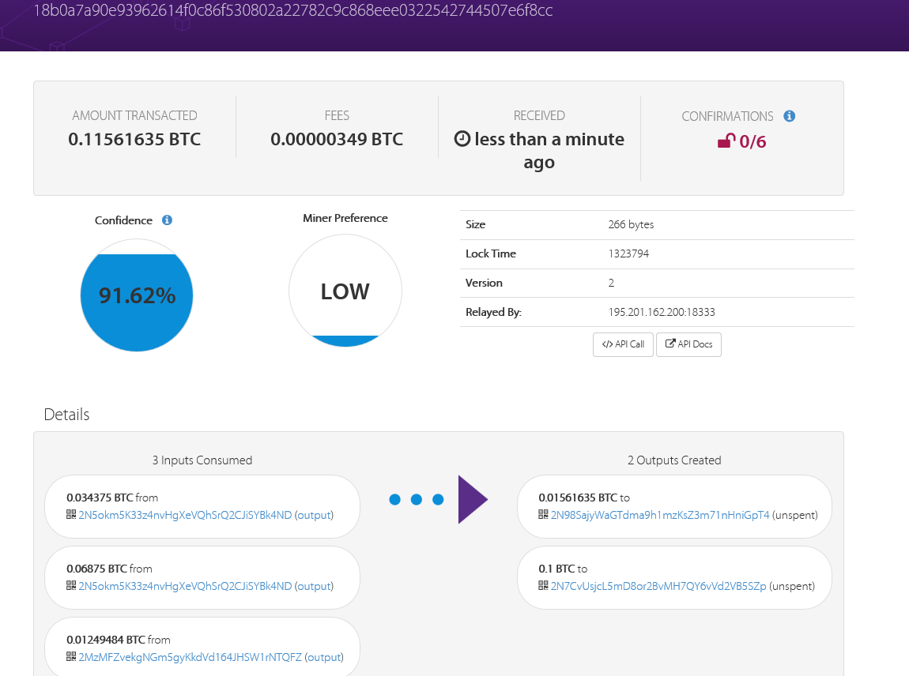
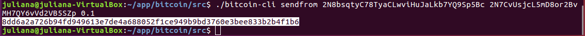

# Bitcoin에 발꼬락 담그기
## Bitcoin daemon이란 뭘까
## Bitcoin core 개발
### Linux 환경에서 Bitcoin core 소스코드를 다운로드받고 빌드를 해보자

full node를 구성하기 위해서는 bitcoin core 전체를 다운로드 받는다.
VM 설정 시 전체 13GB이상의 용량이 필요함에 주의!!

github에서 소스코드를 clone 명령어를 통해 다운받는다.
```
$ git clone https://github.com/bitcoin/bitcoin.git
Cloning into 'bitcoin'...
remote: Counting objects: 102071, done.
remote: Compressing objects: 100% (10/10), done.
Receiving objects: 100% (102071/102071), 86.38 MiB | 730.00 KiB/s, done.
remote: Total 102071 (delta 4), reused 5 (delta 1), pack-reused 102060
Resolving deltas: 100% (76168/76168), done.
Checking connectivity... done
```

다운받은 소스코드 bitcoin으로 이동한 후 빌드 관련 파일(/bitcoin/README.md, /bitcoin/doc/build-~.md )을 보면 dependency 정보를 확인할 수 있다.
본인의 경우 linux 였으므로 build-unix.md파일을 살펴 보았다.
설치에 필요한 dependency는 [dependency.md](https://github.com/bitcoin/bitcoin/blob/master/doc/dependencies.md) 를 보면 된다.

의존성 라이브러리 설치
```
//패키지 갱신
sudo apt-get update
sudo apt-get upgrade
//gcc 설치
sudo apt-get install build-essential libtool autotools-dev autoconf pkg-config libssl-dev
//boost 설치
sudo apt-get install libboost-all-dev
//GUI 라이브러리 설치
sudo apt-get install libqt5gui5 libqt5core5 libqt5dbus5 qttools5-dev qttools5-dev-tools libprotobuf-dev protobuf-compiler
//기타 관련 라이브러리
sudo apt-get install libqrencode-dev
sudo apt-get install libminiupnpc-dev
```

berkey DB를 설치한다
```
mkdir bitcoin/db4/
wget 'http://download.oracle.com/berkeley-db/db-4.8.30.NC.tar.gz'
tar -xzvf db-4.8.30.NC.tar.gz
cd db-4.8.30.NC/build_unix/
../dist/configure --enable-cxx --disable-shared --with-pic --prefix=/home/theusername/bitcoin/db4/
make install
```

빌드를 해본다
```
cd bitcoin
./autogen.sh
```
중간에 에러를 뿜으면 관련된 에러 메시지가 잘 출력되므로 구글신의 도움을 받으면 쉽게 해결 가능하다.
configure 시 다양한 옵션을 부여하여 기능을 설정할 수 있다.
관련 옵션들은 help명령을 치면 볼 수 있음

```./configure
make [-j2]
```
-j 옵션은 코어를 얼마나 사용해서 빌드할지 설정하는 옵션이다.
VM설정 시 세팅한 코어 수에 따라 써도 되고 안써도 된다.
본인은 core를 4개 사용했으므로 그 절반인 2개를 사용하기 위해 -j2 옵션을 사용했다.
잘 모르겠으면 그냥 make만 입력한다

덧)
```
./configure -help
```
예를 들어 GUI를 비활성하여 빌드하고자 할 경우 --without-gui옵션을 함께 전달한다
```
./configure --without-gui
```
덧끝)

Bitcoin core를 설치한다
sudo make install

### 비트코인 데몬(bitcoin daemon, 이하 bitcoind)을 실행해볼까?

#### regtest 환경에서 간단하게 테스트를 해보자.
regression test 환경에서 데몬을 실행해보자.
외부 네트워크를 거치지 않고 내 컴퓨터 내부에서만 동작여부를 테스트 할 수 있다.

데몬 실행
```
bitcoind -regtest -daemon
```
계정은 default로 생성된다.

결과:
```
Bitcoin server starting
```
##### regtest환경에서 Bitcoin core를 조작
regtest상에서 블럭을 생성할 수 있다.
블럭을 생성한 보상으로 BTC를 받는 것을 확인해보자
```
./bitcoin-dli -regtest generate 101
```
결과:
101개의 블록이 생성되면서 각 블럭의 해시값이 표시된다.
```
[
  "39c2a6f947f6af27ea085eb18963f4975903e4e1ea3e1deef6c492b7e935a6a9",
  "7078d9e567d2e07a98da39202fc99bb3f4af305b45871bc63619eb9005c4c2be",
  "2d3028dc124499de8ecec1690e21fefcaa53cf6cefa3253493beb48e57477ce8",
    ..................
]
```
현재 블록수를 확인해보면 101개가 있음을 볼 수 있다.
```
./bitcoin-cli -regtest getblockcount
```
결과:
```
101
```
계좌 생성
은행 계좌와 같이 BTC거래를 가능하게 해주는 주소를 생성해보자
```
./bitcoin-cli -regtest getnewaddress
```
결과:
```
2N5okm5K33z4nvHgXeVQhSrQ2CJiSYBk4ND
```
* 현재 계좌(account)에 대한 버그와 사용자/개발자를 헷갈리게 하는 문제가 있어 account라는 정보는 최신 버전에서 deprecate 되었다.

현재 잔고를 확인해보자
```
./bitcoin-cli -regtest getbalance
```
결과:
```
50.00000000
```
101개의 블록을 생성한 보상으로 받은 50BTC가 사토시 단위까지 표시된다.

옛날 버전으로 daemon을 실행하고, 특정 계좌를 생성하여 송금을 해보자. (-deprecatedrpc=accounts를 추가하여 deamon을 실행하면 account를 사용할 수 있는 이전 버전으로 실행 가능함)
```
./bitcoin-cli -regtest getnewaddress testuser1
```
결과:
```
2NAKG7Uiq3EYxcHBMYWdXvBGak1FVGGNQJe
```
해당 계좌의 잔고를 확인해보면
```
./bitcoin-cli -regtest getbalance testuser1
```
결과:
```
0.00000000
```
방금 생성한 계정이기 때문에 BTC는 0으로 표시된다.

이제 송금을 해보자.
testuser1의 주소를 이용해 10BTC를 송금한다
```
./bitcoin-cli -regtest sendtoaddress 2NAKG7Uiq3EYxcHBMYWdXvBGak1FVGGNQJe
```
결과:
```
78b5da77bc09cba86f6be2a711f722755301a82440f2f684b653f88cee2b2e85
```
해당 거래(transaction)의 식별번호(txid)가 출력된다.

트랜젝션을 확인해보자
```
./bitcoin-cli -regtest listunspent 0
```
* 0옵션은 regtest이므로 확정(confirm)되지 않은 거래를 조회해야 내역이 나오기 때문이다. 0 옵션 없이 실행하면 아무 정보도 출력되지 않는다. 아래 결과의 confirmations가 모두 0임을 볼 수 있음.
결과:
```
[
  {
    "txid": "78b5da77bc09cba86f6be2a711f722755301a82440f2f684b653f88cee2b2e85",
    "vout": 0,
    "address": "2NAKG7Uiq3EYxcHBMYWdXvBGak1FVGGNQJe",
    "account": "testuser1",
    "redeemScript": "00142e72390322db36656beb85f02ce9efe72c958ec0",
    "scriptPubKey": "a914bb3d9342c905e8bf31197806902909f61621648787",
    "amount": 10.00000000,
    "confirmations": 0,
    "spendable": true,
    "solvable": true,
    "safe": true
  },
  {
    "txid": "78b5da77bc09cba86f6be2a711f722755301a82440f2f684b653f88cee2b2e85",
    "vout": 1,
    "address": "2N3z39X96P4BnWN1mQ1aty559bA8KVUdsWi",
    "redeemScript": "00146b7c56f85be312d806661786e566f336b12f2e7c",
    "scriptPubKey": "a91475ca18445250be72975c5b85d054203c60c870f787",
    "amount": 39.99996240,
    "confirmations": 0,
    "spendable": true,
    "solvable": true,
    "safe": true
  }
]
```
50 BTC 중 10BTC를 송금해 40BTC가 남아야 하지만, 채굴자에게 수수료를 지불하여 40BTC가 안되는 금액이 남아있다.

잔고를 확인해보면
./bitcoin-cli -regtest getbalance
49.99996240
송금이 확정되지 않았으므로 아직 10BTC는 내 지갑에 있다.

--------------------------------------------------------------------

채굴을 통해 거래가 확정되면 10BTC가 송금완료됨을 볼 수 있다.
새로운 블록 1개를 생성하면 이전 거래내역이 블록에 저장되고 송금이 확정된다.
```
./bitcoin-cli -regtest generate 1
```
결과:
```
[
  "1e30cc6e447919db0a3d0a263cbf0f4f6422a5eabf5ae3b4781d92f6b3588c05"
]
```

송금 확정 여부를 확인해보자
```
./bitcoin-cli -regtest listunspent
```
결과:
```
[
  {
    "txid": "d00005e3a15ff9729d02c8ccc60077a4a5f8e12874c94508999f8b6e26daf606",
    "vout": 0,
    "address": "mvDNBHYr89vYLVQk9tkYTYLaajfWQSjSX3",
    "scriptPubKey": "21034a81585ab8e5c9979d11e3467d37b59046636e29ad5b35ea2d2432a4584de720ac",
    "amount": 50.00000000,
    "confirmations": 101,
    "spendable": true,
    "solvable": true,
    "safe": true
  },
  {
    "txid": "78b5da77bc09cba86f6be2a711f722755301a82440f2f684b653f88cee2b2e85",
    "vout": 0,
    "address": "2NAKG7Uiq3EYxcHBMYWdXvBGak1FVGGNQJe",
    "account": "testuser1",
    "redeemScript": "00142e72390322db36656beb85f02ce9efe72c958ec0",
    "scriptPubKey": "a914bb3d9342c905e8bf31197806902909f61621648787",
    "amount": 10.00000000,
    "confirmations": 1,
    "spendable": true,
    "solvable": true,
    "safe": true
  },
  {
    "txid": "78b5da77bc09cba86f6be2a711f722755301a82440f2f684b653f88cee2b2e85",
    "vout": 1,
    "address": "2N3z39X96P4BnWN1mQ1aty559bA8KVUdsWi",
    "redeemScript": "00146b7c56f85be312d806661786e566f336b12f2e7c",
    "scriptPubKey": "a91475ca18445250be72975c5b85d054203c60c870f787",
    "amount": 39.99996240,
    "confirmations": 1,
    "spendable": true,
    "solvable": true,
    "safe": true
  }
]
```
testuser1의 잔고를 확인해보면
```
./bitcoin-cli -regtest getbalance testuser1
```
결과:
```
10.00000000
```
10BTC가 확인된다.

---------------------------------------------------------------------------

#### testnet 환경에서 테스트를 해보자. (configurate the Bitcoin testnet)
비트코인 코어를 실행하기 위한 테스트 네트워크를 구축해 봅시다.

daemon을 실행하기 위한 다양한 조건 및 옵션을 설정할 수 있다.
특히 testnet을 사용하는 여부를 설정해줘야 테스트넷 환경에서 데몬이 실행된다.

bitcoind 관련 옵션은 -help 명령을 통해 확인 가능함
```
./bitcoind -help
~/app/bitcoin/src$ ./bitcoind -help
Bitcoin Core Daemon version v0.16.99.0-e24bf1c

Usage:
  bitcoind [options]                     Start Bitcoin Core Daemon

Options:

  -?
       Print this help message and exit

  -alertnotify=<cmd>
       Execute command when a relevant alert is received or we see a really
       long fork (%s in cmd is replaced by message)

  -assumevalid=<hex>
       If this block is in the chain assume that it and its ancestors are valid
       and potentially skip their script verification (0 to verify all,
       default:
       0000000000000000005214481d2d96f898e3d5416e43359c145944a909d242e0,
       testnet:
       0000000002e9e7b00e1f6dc5123a04aad68dd0f0968d8c7aa45f6640795c37b1)

  -blocknotify=<cmd>
       Execute command when the best block changes (%s in cmd is replaced by
       block hash)

  -blockreconstructionextratxn=<n>
       Extra transactions to keep in memory for compact block reconstructions
       (default: 100)

  -blocksdir=<dir>
       Specify blocks directory (default: <datadir>/blocks)

  -conf=<file>
       Specify configuration file. Relative paths will be prefixed by datadir
       location. (default: bitcoin.conf)

  -daemon
       Run in the background as a daemon and accept commands

```

데몬실행 시 특정 위치의 bitcoin.conf 파일을 default로 읽어 실행한다.  
bitconf.conf파일 위치는 OS별로 아래와 같다.  

|  <center>OS</center> |  <center>Default bitcoin datadir</center> |  <center>Typical path to configuration file</center> |
|:--------|:--------|:--------|
|Windows | %APPDATA%\Bitcoin\ | C:\Users\username\AppData\Roaming\Bitcoin\bitcoin.conf |
|Linux | $HOME/.bitcoin/ | /home/username/.bitcoin/bitcoin.conf |
|OSX | $HOME/Library/Application Support/Bitcoin/ | /Users/username/Library/Application Support/Bitcoin/bitcoin.conf |

아직 데몬을 실행하지 않았다면 해당 경로에 bitcoin.conf파일이 없을 것이다.
regtest이므로 일단 데몬을 실행하면 해당 경로에 임의로 계정이 생성된다.

데몬 실행
```
./bitcoind -regtest -daemon
```


* bitcoin.conf파일의 내용 설명과 example은 [여기](https://github.com/bitcoin/bitcoin/blob/master/contrib/debian/examples/bitcoin.conf)서 볼 수 있음.

#### Execute
데몬을 실행하여 테스트넷 블록 데이터를 받아봅시다.
```
~/app/bitcoin/src$ ./bitcoind -txindex -daemon
Bitcoin server starting
```
Bitcoin server stating이란 메시지가 나오면 데몬이 background에서 실행되고 있음을 나타낸다.

그럼 tx정보를 잘 받고있는지 확인해보자
bitcoin.conf파일이 있는 경로의 testnet폴더 내의 debug.log파일을 추적한다.
```
tail -f /home/username/.bitcoin/testnet3/debug.log
....
2018-06-05T06:47:17Z UpdateTip: new best=000000000000004da98d4fe85e4431445e5082b3ff4fe7220b7dc7222771d38f height=1322934 version=0x2000e000 log2_work=70.088861 tx=18323448 date='2018-06-05T06:59:49Z' progress=1.000004 cache=0.2MiB(1564txo) warning='3 of last 100 blocks have unexpected version'
2018-06-05T06:52:56Z UpdateTip: new best=00000000000001641aba501c45e5b565fada2e660a1cdfacc5503ce2f156af89 height=1322935 version=0x20000000 log2_work=70.088919 tx=18323496 date='2018-06-05T07:04:43Z' progress=1.000003 cache=0.2MiB(1705txo) warning='3 of last 100 blocks have unexpected version'
2018-06-05T07:06:16Z UpdateTip: new best=00000000000001273c82b52c991531a0492dc6e34f560419238b3886702230ab height=1322936 version=0x20000000 log2_work=70.088977 tx=18323563 date='2018-06-05T07:17:53Z' progress=1.000003 cache=0.3MiB(1859txo) warning='3 of last 100 blocks have unexpected version'
....
```
* 위 로그 중 height가 블록의 위치이고, testnet의 총 블록 크기는 [여기]()서 확인할 수 있다. (모두 완료하는데 4시간 정도 걸림)
만약, 용량이 충분하지 않을 경우 ./deamond 커멘드시 또는 bitcoin.conf파일에  prune=<n> 옵션을 사용해보자.

### 테스트넷으로 비트코인을 가지고 놀아보자 (Let's play with bitcoin in testnet)

1) 비트코인 입금 주소 생성 (make new address of Bitcoin)
```
./bitcoin-cli getnewaddress
```
결과:
```
2N5okm5K33z4nvHgXeVQhSrQ2CJiSYBk4ND
```

2) Bitcoin Faucet을 통한 테스트 코인 수령 (How can I get Bitcoin test coin?)
https://en.bitcoin.it/wiki/Testnet 페이지의 Faucets 링크를 통해 다양한 Faucet에서 테스트용 비트코인을 얻을 수 있다.


3) 특정 주소 신규 생성 후 해당 주소에 비트코인 전송 해보기 (Send Bitcoin to new specific address)  

특정 account를 이용해 신규 주소를 생성해보자.
chocoaddress0와 chocoaddress1 두개를 생성해보았다.  
chocoaddress0생성
```
./bitcoin-cli getnewaddress chocoaddress0
```
결과:
```
2N5okm5K33z4nvHgXeVQhSrQ2CJiSYBk4ND
```
chocoaddress1생성
```
./bitcoin-cli getnewaddress chocoaddress0
```
결과:
```
2N8bsqtyC78TyaCLwviHuJaLkb7YQ9Sp5Bc
```
내 account의 주소 2개가 생성됨을 볼 수 있다.

친구의 주소(2N7CvUsjcL5mD8or2BvMH7QY6vVd2VB5SZp)로 0.1 BTC를 보내보았다.
```
./bitcoin-cli sendtoaddress 2N7CvUsjcL5mD8or2BvMH7QY6vVd2VB5SZp 0.1
```
결과:
```
18b0a7a90e93962614f0c86f530802a22782c9c868eee0322542744507e6f8cc
```
해당 transaction의 txid가 출력된다.

이 txid를 이용해 [bitcoin browser](https://live.blockcypher.com/btc-testnet/)에서 조회 가능하다
조회 결과:



위 txid 조회 결과에서 보듯이 내가 보유한 UTXO들을 모아 전송할 금액인 0.1BTC를 구성한 후 친구주소로 0.1BTC와 수수료인 0.0156BTC를 전송하는 모습을 볼 수 있다.  


이처럼, sendtoaddres는 수신자의 주소와 보낼금액을 입력하여 전송하게 된다.
sendtoaddress명령은 내 서버 내의 account에 상관 없이 server가 가지고 있는 BTC 총합(UTXO의 총합)이 충분하다면 언제나 거래가 성공한다.

* 비트코인을 전송하는 명령 중 move나 sendfrom이라는 명령어도 있는데 차이점은 무엇일까? 아래에서 살펴봅시다.

*sendfrom* 명령어 사용해보기
sendfrom은 특정 account에서 destination address로 BTC를 전송하는 명령어이다.
따라서 해당 account에 충분한 BTC가 없을 경우 전송이 실패된다.


move 명령은 내가 가진 account 간에 BTC를 옮기는 명령어 이다.
일단 위에서 fail한 account의 잔고를 확인해보면 0임을 알 수 있다.  


move 명령을 이용해 여유가 있는 chocoaddress0 account에서 chocoaddress1 account로 0.2BTC를 옮긴 후 잔고를 확인해보자.


0.2BTC가 옮겨졌음을 확인했으니, 이제 다시 sendfrom으로 chocoaddress1에서 친구에게 코인을 전송해보자



해당 트랜잭션의 txid가 출력된다.

4) transaction거래 정보 확인
  * gettransaction과 getrawtransaction 명령의 차이
gettransaction명령을 사용해보자.  


해당 transaction이 포함하고 있는 상세한 정보와 hash값을 볼 수 있다.

getrawtransaction 명령을 사용해보자


해당 transaction의 정보의 hash값을 볼 수 있다.


5) 다른 네티워크 노드 전파를 통한 트랜잭션 진행과정 살펴보기

  * 거래 내역을 확인할 수 있는 사이트
    * [Block Explorer](https://blockexplorer.com/)를 통해 거래 살펴보기
    * testnet은 [여기](https://live.blockcypher.com/btc-testnet/) 또는 [testnet.blockchain.info](https://testnet.blockchain.info/)에서 확인 가능

6) confirmations란 뭘까? (What is confirmations?)
confirmation을 이해하기 전에 우리는 거래의 원래와 검증 과정을 이해할 필요가 있다.


7) UTXO(Unspent Transaction Output)란 뭘까? (What is UTXO?)

* UTXO는 특정 지갑에서 소유하고 있는 '비트코인 덩어리' 또는 그 금액만큼의 '비트코인 지폐'라고 생각하면 쉽다.  
예를 들어 내가 처음으로 1BTC를 누군가에게 받았다. 그럼 이 거래의 UTXO는 1BTC 지폐로 볼 수 있다.
이후 내가 0.5BTC짜리 물건을 사고 지불해야 할 때, 이 1BTC지폐를 사용해 0.5BTC를 지불하고 거스름돈 0.5BTC를 돌려받는다. 그리고 거슬러받은 0.5BTC는 나에게 새로운 UTXO가 되는 것이다.  
*만원짜리 지폐를 찢어서 사용할 수 없는 것처럼 UTXO를 쪼개서 사용하지 않고 사용가능한 UTXO를 지갑에서 찾아 입력값에 넣은 다음 출력값으로 잔액을 되돌려 받는 형식인 것이다.*

### JSON-RPC로 명령해보기
  * 입금 주소 생성(getnewaddress)
  * 트랜잭션 목록 조회(listtransactions)
  * 전송(sendtoaddress)  
  (bitcoin-cli help [commend]를 입력하면, 해당 명령의 설명 및 curl을 이용한 JSON-RPC전송 예제가 상세히 나온다)

### Bitcoin core Programmatic Interface
사용하기 다소 복잡한 JSON-RPC명령을 다양한 언어를 이용해 간편화 할 수 있다.
-공부중-

### 참고
* [Bitcoin Wiki](https://en.bitcoin.it/wiki/Running_Bitcoin)
* [bitcoin-cli 명령](https://en.bitcoin.it/wiki/Original_Bitcoin_client/API_calls_list)
* [Bitcoin 거래 원리와 과정](https://steemit.com/kr/@easyblockchain/2odxha-1)
